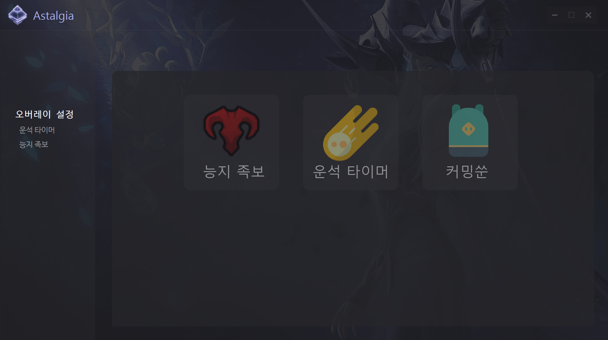
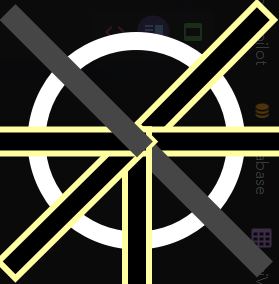
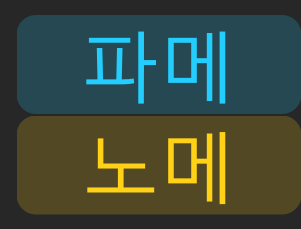
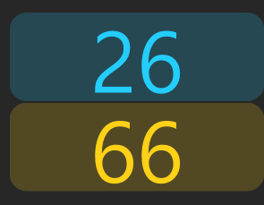

# Astalgia
로스트아크 오버레이 유틸리티

## Installation
- `install.bat` 을 실행하면 설치가 완료됩니다.
- `Launcher.bat` 으로 프로그램을 실행 할 수 있습니다.
- 로스트 아크 위에서 단축키 기능을 사용하려면 관리자 권한으로 실행해야 합니다.

## Hou to use
### 능지 족보
- 능지 족보 버튼을 클릭하면 기능이 활성화 됩니다.
- 단축키 `Ctrl + Shift + F3` 을 통해 활성화 시킬 수 있습니다.

- 능지 패턴에서 나온 방향 중 아래쪽 3 갈래(5시, 6시, 7시)를 클릭해 활성화하면 해당하는 전체 문양이 표시됩니다.
- 한번 더 클릭해 해당 방향을 비활성화 할 수 있습니다.
### 운석 타이머
- 운석 타이머 버튼을 클릭하면 기능이 활성화 됩니다.
- 단축키 `Ctrl + Shift + F2` 을 통해 활성화 시킬 수 있습니다.

- 각 버튼을 클릭하면 타이머가 시작됩니다.
- `파메` 버튼은 파란색 운석 시간 타이머로 60초가 카운트 됩니다.
- `노메` 버튼은 노란색 운석이 떨어진 뒤 지형이 복구되는 시간 타이머로 100초가 카운트 됩니다.
## LICENCE
- 이 프로그램은 MIT 라이선스를 따릅니다.
- 이 프로그램에는 네이버에서 제공한 나눔 고딕 글꼴이 포함되어 있습니다.
- 이 프로그램에는 OFL라이센스에 따라 D2Coding 글꼴이 포함되어 있습니다.
## Special thanks
- Background image by Embrase3d
